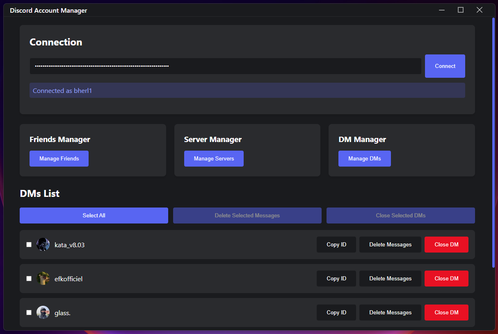
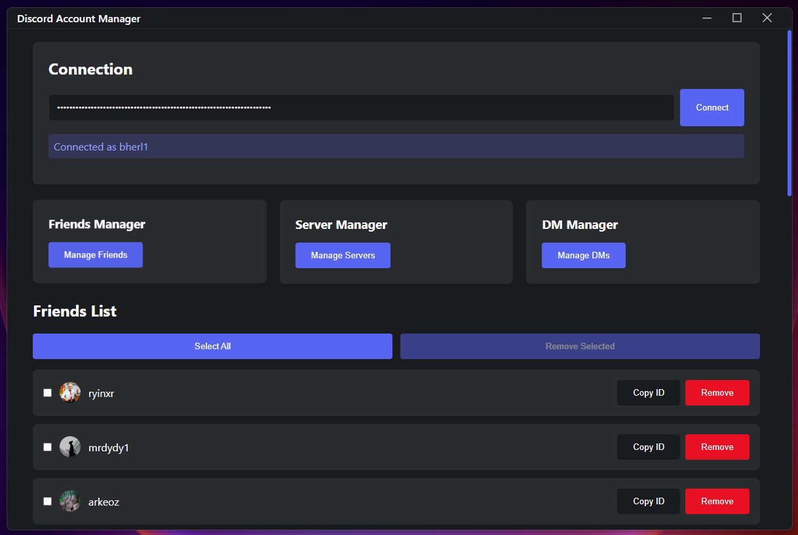

# ` 🎮 `︲Documentation : Discord Account Manager

---

Ce dépôt présente une application de bureau puissante et intuitive construite avec **Electron.js** pour gérer efficacement ton compte Discord.
Tu y apprendras à **installer l'application**, **gérer tes serveurs et amis**, et **supprimer des messages en masse** en quelques clics.

---

> [!IMPORTANT]
> **Discord Account Manager** est actuellement en développement actif.
> Les mises à jour et nouvelles fonctionnalités sont ajoutées régulièrement.
> ⚠️ **Utilise cet outil de manière responsable et conforme aux conditions d'utilisation de Discord.**

---

## `📑`︲Sommaire (cliquez pour accéder directement à la section souhaitée)

1. [`📘`︲Introduction.](#introduction)
   * [`❔`︲Présentation du projet.](#presentation-projet)
   * [`✨`︲Fonctionnalités principales.](#fonctionnalites)
   * [`🧰`︲Technologies utilisées.](#technologies)

2. [`🛠️`︲Prérequis et installation.](#prerequis-installation)
   * [`📋`︲Prérequis système.](#prerequis-systeme)
   * [`⬇️`︲Clonage du dépôt.](#clonage-depot)
   * [`📦`︲Installation des dépendances.](#installation-dependances)

3. [`🚀`︲Lancement de l'application.](#lancement-application)
   * [`💻`︲Mode développement.](#mode-developpement)
   * [`📦`︲Exécutable précompilé (Windows).](#executable-precompile)

4. [`⚙️`︲Utilisation de l'application.](#utilisation-application)
   * [`🌐`︲Gestion des serveurs.](#gestion-serveurs)
   * [`👥`︲Gestion des amis.](#gestion-amis)
   * [`🗑️`︲Suppression de messages en masse.](#suppression-messages)

5. [`🤝`︲Contribution au projet.](#contribution)
   * [`🔧`︲Comment contribuer.](#comment-contribuer)
   * [`💡`︲Idées d'amélioration.](#idees-amelioration)

6. [`📚`︲Informations complémentaires.](#informations-complementaires)
   * [`📄`︲Licence.](#licence)
   * [`🔗`︲Liens utiles.](#liens-utiles)
   * [`🙏`︲Remerciements.](#remerciements)

---

<a id="introduction"></a>
# `📘`︲Introduction.

---

<a id="presentation-projet"></a>
### `❔`︲Présentation du projet.

> [!NOTE]
> **Discord Account Manager** est une application de bureau conçue pour simplifier la gestion de ton compte Discord.
> Que tu sois administrateur, modérateur ou utilisateur régulier, cet outil te permet d'effectuer des actions complexes en quelques clics.
> L'objectif est de te faire gagner du temps et d'optimiser la gestion de tes serveurs, amis et messages.


---

<a id="fonctionnalites"></a>
### `✨`︲Fonctionnalités principales.

> [!TIP]
> **Découvre les fonctionnalités qui rendent Discord Account Manager unique :**

| Fonctionnalité | Description |
|---------------|-------------|
| `🌐` **Gestion des serveurs** | Ajoute, gère ou quitte des serveurs Discord facilement |
| `👥` **Gestion des amis** | Organise ta liste d'amis : ajout, suppression, recherche |
| `🗑️` **Suppression de messages** | Supprime plusieurs messages en masse (serveurs ou DM) |
| `🎨` **Interface intuitive** | UI élégante qui simplifie les actions Discord complexes |
| `⚡` **Multiplateforme** | Compatible Windows, macOS, Linux (compilation source) |
| `🪶` **Léger et rapide** | Optimisé pour une performance fluide |

---

<a id="technologies"></a>
### `🧰`︲Technologies utilisées.

> [!IMPORTANT]
> Stack technologique du projet :
> - `⚡`︲**Frontend :** Electron.js ︲[`🌐`](https://www.electronjs.org/)
> - `💻`︲**Backend :** Node.js ︲[`🌐`](https://nodejs.org/)
> - `🤖`︲**API Discord :** Discord.js-Selfbot-V13 ︲[`🌐`](https://www.npmjs.com/package/discord.js-selfbot-v13)
> - `📦`︲**Gestionnaire de paquets :** npm ︲[`🌐`](https://npmjs.com/)
> - `🔨`︲**Build Tools :** Electron-builder

---

<a id="prerequis-installation"></a>
# `🛠️`︲Prérequis et installation.

---

<a id="prerequis-systeme"></a>
## `📋`︲Prérequis système.

> [!NOTE]
> Avant de pouvoir exécuter **Discord Account Manager** localement, assure-toi d'avoir installé les éléments suivants :

### `📦`︲Logiciels requis.

* `💚` ︲**Node.js :** Version LTS recommandée ︲[`🌐`](https://nodejs.org/)
* `📦` ︲**npm :** Fourni avec Node.js (gestionnaire de paquets)
* `💻` ︲**Git :** Pour cloner le dépôt ︲[`🌐`](https://git-scm.com/)

---

### `✅`︲Vérification de l'installation.

Pour vérifier si Node.js et npm sont installés :

```bash
node -v
npm -v
```

> [!TIP]
> Si ces commandes affichent les numéros de version, tu es prêt à continuer !

---

<a id="clonage-depot"></a>
## `⬇️`︲Clonage du dépôt.

---

1️⃣︲**Cloner le dépôt GitHub.**

```bash
git clone https://github.com/Bherl1/DiscordAccMgr.git
```

---

2️⃣︲**Naviguer dans le dossier du projet.**

```bash
cd DiscordAccMgr
```

<details>
  <summary><strong>📸︲Aperçu de la structure du projet</strong></summary>
  
  ```
  DiscordAccMgr/
  ├── images/
  │   ├── 1.png
  │   ├── 2.png
  │   └── 3.png
  ├── src/
  ├── package.json
  ├── README.md
  └── LICENSE
  ```
</details>

---

<a id="installation-dependances"></a>
## `📦`︲Installation des dépendances.

---

> [!NOTE]
> Cette étape télécharge et installe tous les modules Node.js requis pour faire fonctionner l'application.

---

1️⃣︲**Installer les dépendances npm.**

```bash
npm install
```

> [!TIP]
> 💡 Cette commande peut prendre quelques minutes lors de la première installation.
> Toutes les dépendances seront installées dans le dossier `node_modules/`.

---

2️⃣︲**Vérification de l'installation.**

Une fois terminé, vérifie que le dossier `node_modules/` a été créé :

```bash
ls -la
```

---

<a id="lancement-application"></a>
# `🚀`︲Lancement de l'application.

---

<a id="mode-developpement"></a>
## `💻`︲Mode développement.

---

> [!NOTE]
> Le mode développement permet de lancer l'application avec rechargement automatique lors des modifications du code.

---

1️⃣︲**Lancer l'application en mode dev.**

```bash
npm run start
```

---

2️⃣︲**Fenêtre Electron.**

Une fenêtre Electron s'ouvrira automatiquement avec l'application en cours d'exécution.

<details>
  <summary><strong>📸︲Captures d'écran de l'application</strong></summary>
  
  **Gestionnaire de messages privés :**
  
  
  **Gestionnaire de serveurs :**
  
  
  **Gestionnaire d'amis :**
  
</details>

> [!TIP]
> Utilise `Ctrl + Shift + I` (ou `Cmd + Option + I` sur macOS) pour ouvrir les outils de développement.

---

<a id="executable-precompile"></a>
## `📦`︲Exécutable précompilé (Windows).

---

> [!TIP]
> Pour les utilisateurs Windows, un fichier `.exe` précompilé est disponible pour une installation sans configuration !

---

### `⬇️`︲Téléchargement.

1️⃣︲**Accéder à la page des releases.**

Rends-toi sur la page **︲[`📦` Releases](https://github.com/Bherl1/DiscordAccMgr/releases)**

---

2️⃣︲**Télécharger le fichier .exe.**

* Télécharge la dernière version du fichier `.exe`
* Aucune installation de Node.js ou npm n'est nécessaire

---

3️⃣︲**Lancer l'application.**

Double-clique sur le fichier `.exe` pour lancer l'application.

> [!WARNING]
> **Windows Defender peut afficher un avertissement lors du premier lancement.**
> C'est normal pour les applications non signées. Clique sur "Plus d'informations" puis "Exécuter quand même".

---

<a id="utilisation-application"></a>
# `⚙️`︲Utilisation de l'application.

---

> [!NOTE]
> Cette section détaille les fonctionnalités principales de **Discord Account Manager** et comment les utiliser efficacement.

---

<a id="gestion-serveurs"></a>
## `🌐`︲Gestion des serveurs.

---

### `📋`︲Fonctionnalités disponibles.

| Action | Description |
|--------|-------------|
| `👁️` **Visualiser** | Affiche tous tes serveurs Discord |
| `➕` **Rejoindre** | Rejoint un nouveau serveur via invitation |
| `🚪` **Quitter** | Quitte les serveurs que tu ne veux plus |
| `🔍` **Rechercher** | Trouve rapidement un serveur spécifique |

---

### `🎯`︲Utilisation.

1️⃣︲**Accéder au gestionnaire de serveurs.**

* Lance l'application
* Sélectionne l'onglet "Server Manager"

---

2️⃣︲**Effectuer des actions.**

* Utilise les boutons pour rejoindre ou quitter des serveurs
* La liste se met à jour automatiquement

<details>
  <summary><strong>📸︲Interface Server Manager</strong></summary>
  
  
</details>

---

<a id="gestion-amis"></a>
## `👥`︲Gestion des amis.

---

### `📋`︲Fonctionnalités disponibles.

| Action | Description |
|--------|-------------|
| `👁️` **Liste** | Affiche tous tes amis Discord |
| `➕` **Ajouter** | Envoie une demande d'ami |
| `❌` **Supprimer** | Retire un ami de ta liste |
| `🔍` **Rechercher** | Trouve un ami rapidement |

---

### `🎯`︲Utilisation.

1️⃣︲**Accéder au gestionnaire d'amis.**

* Lance l'application
* Sélectionne l'onglet "Friends Manager"

---

2️⃣︲**Gérer ta liste d'amis.**

* Ajoute de nouveaux amis en entrant leur nom d'utilisateur
* Supprime les contacts que tu ne veux plus garder

<details>
  <summary><strong>📸︲Interface Friends Manager</strong></summary>
  
  
</details>

---

<a id="suppression-messages"></a>
## `🗑️`︲Suppression de messages en masse.

---

> [!WARNING]
> **Attention : La suppression de messages est irréversible !**
> Assure-toi de bien vouloir supprimer les messages avant de confirmer l'action.

---

### `📋`︲Fonctionnalités disponibles.

| Action | Description |
|--------|-------------|
| `🗑️` **Supprimer DM** | Supprime tous les messages d'une conversation |
| `🗑️` **Supprimer Server** | Supprime tes messages dans un serveur |
| `🔢` **Sélection** | Choisis le nombre de messages à supprimer |

---

### `🎯`︲Utilisation.

1️⃣︲**Accéder au gestionnaire de messages.**

* Lance l'application
* Sélectionne l'onglet "DM Manager"

---

2️⃣︲**Configurer la suppression.**

* Sélectionne la conversation ou le serveur ciblé
* Définis le nombre de messages à supprimer
* Confirme l'action

---

3️⃣︲**Suivi du processus.**

* Une barre de progression s'affiche pendant la suppression
* L'opération peut prendre du temps selon le nombre de messages

> [!TIP]
> Discord limite le taux de suppression pour éviter le spam.
> L'application respecte automatiquement ces limites pour éviter les bannissements temporaires.

<details>
  <summary><strong>📸︲Interface DM Manager</strong></summary>
  
  
</details>

---

<a id="contribution"></a>
# `🤝`︲Contribution au projet.

---

<a id="comment-contribuer"></a>
## `🔧`︲Comment contribuer.

---

> [!NOTE]
> Les contributions de la communauté sont les bienvenues !
> Voici comment participer au développement de **Discord Account Manager**.

---

### `📝`︲Processus de contribution.

1️⃣︲**Forker le dépôt.**

Clique sur le bouton "Fork" sur GitHub pour créer ta propre copie du projet.

---

2️⃣︲**Créer une branche.**

```bash
git checkout -b feature/ta-fonctionnalite
```

---

3️⃣︲**Effectuer tes modifications.**

* Modifie le code
* Teste tes changements localement
* Assure-toi que le code suit le style existant

---

4️⃣︲**Commiter les changements.**

```bash
git commit -am 'Ajout de ma nouvelle fonctionnalité'
```

---

5️⃣︲**Pousser vers ton fork.**

```bash
git push origin feature/ta-fonctionnalite
```

---

6️⃣︲**Créer une Pull Request.**

Ouvre une Pull Request sur GitHub avec une description détaillée de tes modifications.

> [!TIP]
> Plus ta description est claire et détaillée, plus il sera facile d'accepter ta contribution !

---

<a id="idees-amelioration"></a>
## `💡`︲Idées d'amélioration.

---

> [!NOTE]
> Voici quelques idées de fonctionnalités futures auxquelles tu pourrais contribuer :

### `🚀`︲Fonctionnalités à développer.

| Fonctionnalité | Description | Priorité |
|---------------|-------------|----------|
| `🔄` **Multi-comptes** | Basculer facilement entre plusieurs comptes Discord | `🔴` Haute |
| `📺` **Gestion des salons** | Gérer les salons (mute, suppression, etc.) | `🟡` Moyenne |
| `🔍` **Recherche avancée** | Recherche puissante de messages avant suppression | `🟡` Moyenne |
| `🍎` **Support macOS** | Compilation native pour macOS | `🟢` Basse |
| `🐧` **Support Linux** | Compilation native pour Linux | `🟢` Basse |
| `🌙` **Mode sombre** | Thème sombre complet de l'interface | `🟡` Moyenne |

---

<a id="informations-complementaires"></a>
# `📚`︲Informations complémentaires.

---

<a id="licence"></a>
## `📄`︲Licence.

---

> [!NOTE]
> Ce projet est distribué sous la **licence MIT**.
> Consulte le fichier ︲[`📄` LICENSE](LICENSE)︲ pour plus de détails.

### `✅`︲En résumé :

* ✅ Utilisation commerciale autorisée
* ✅ Modification autorisée
* ✅ Distribution autorisée
* ✅ Utilisation privée autorisée
* ⚠️ Aucune garantie fournie

---

<a id="liens-utiles"></a>
## `🔗`︲Liens utiles.

---

| Ressource | Lien |
|-----------|------|
| `💬` **Serveur Discord** | ︲[`🌐` Rejoindre la communauté](https://discord.gg/7wVU2jnjey)︲ |
| `🐛` **Bug Tracker** | ︲[`🌐` Signaler un bug](https://github.com/Bherl1/DiscordAccMgr/issues)︲ |
| `📦` **Releases** | ︲[`🌐` Télécharger](https://github.com/Bherl1/DiscordAccMgr/releases)︲ |
| `💻` **Code Source** | ︲[`🌐` GitHub](https://github.com/Bherl1/DiscordAccMgr)︲ |

---

<a id="remerciements"></a>
## `🙏`︲Remerciements.

---

> [!NOTE]
> Nous remercions les bibliothèques et outils suivants qui ont rendu ce projet possible :

### `🧰`︲Dépendances principales.

* `⚡`︲**Electron.js** - Framework d'application de bureau ︲[`🌐`](https://www.electronjs.org/)
* `🤖`︲**Discord.js-Selfbot-V13** - Bibliothèque API Discord ︲[`🌐`](https://www.npmjs.com/package/discord.js-selfbot-v13)
* `💚`︲**Node.js** - Environnement d'exécution JavaScript ︲[`🌐`](https://nodejs.org/)
* `📦`︲**npm** - Gestionnaire de paquets Node.js ︲[`🌐`](https://npmjs.com/)

---

### `💖`︲Merci à la communauté !

Un grand **merci** pour ton intérêt pour **Discord Account Manager** !
Nous espérons que cet outil améliore ton expérience Discord.

> [!TIP]
> Si tu aimes ce projet, n'hésite pas à lui donner une ⭐ sur GitHub !

---

## `🛟`︲Support & Feedback.

---

> [!NOTE]
> Si tu rencontres des problèmes ou si tu as des suggestions d'amélioration :

### `📬`︲Comment nous contacter.

1️⃣︲**Signaler un bug.**

Ouvre une issue dans la section ︲[`🐛` Issues](https://github.com/Bherl1/DiscordAccMgr/issues)︲

---

2️⃣︲**Poser une question.**

Rejoins notre serveur Discord : ︲[`💬` discord.gg/7wVU2jnjey](https://discord.gg/7wVU2jnjey)︲

---

3️⃣︲**Proposer une fonctionnalité.**

Crée une issue avec le tag `enhancement` sur GitHub.

---

> [!TIP]
> **Discord Account Manager** est en développement actif et ton feedback est précieux pour améliorer l'application !

---

**Développé avec 💜 par la communauté**

---
